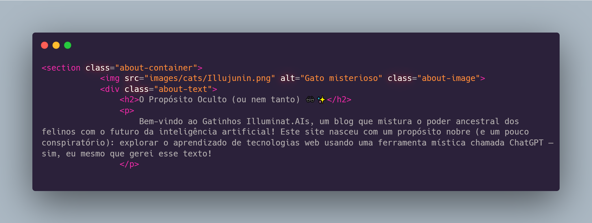

# Gatinhos Illuminat.AIs

Bem-vindo ao projeto **Gatinhos Illuminat.AIs**! Este é um site humorístico e fantasioso feito por aprendizado, combinando o charme dos felinos com o presente da inteligência artificial. O objetivo deste projeto é explorar e aprender tecnologias web usando as ferramentas do ChatGPT.

### Arquivos Principais

- **index.html**: Página principal do site, contendo um carrossel de imagens e uma listagem de outras imagens com descrições.
- **sobre.html**: Página "Sobre" do site, explicando o propósito e a história fictícia dos gatos influentes.
- **css/styles.css**: Arquivo de estilos CSS para o site.
- **images/cats/**: Diretório contendo as imagens dos gatos mencionados no site.

## Funcionalidades

- **Carrossel de Imagens**: Um carrossel que exibe imagens de gatos históricos com descrições.
- **Listagem de Imagens**: Uma listagem de outras imagens de gatos com descrições ao lado.
- **Página Sobre**: Uma página que explica o propósito do site e a história fictícia dos gatos influentes.

## Tecnologias Utilizadas

- **HTML**: Para a estrutura das páginas.
- **CSS**: Para a estilização das páginas.
- **JavaScript**: Para a funcionalidade do carrossel de imagens.
- **ChatGPT**: Utilizado na criação do conteúdo do site.
- **DALL-E**: Utilizado por meio do ChatGPT-4o para gerar as imagens.
- **TensorFlow**: Utilizado para gerar a imagem `Illujunin.png`.
- **GitHub Copilot**: Utilizado para geração da documentação, através da integração com o VS Code.

## Como Executar o Projeto

1. Clone o repositório para o seu ambiente local.
2. Abra o arquivo `index.html` em um navegador web para visualizar a página principal.
3. Navegue para `sobre.html` para visualizar a página "Sobre".

## Contribuição

Contribuições são bem-vindas! Se você tiver sugestões ou melhorias, sinta-se à vontade para abrir uma issue ou enviar um pull request.

## Licença

Este projeto é licenciado sob a [MIT License](LICENSE).

## Imagens do Projeto

### Exemplo de Código

### Illujunin

---

© 2025 Gatinhos Illuminat.AIs - Um site humorístico e educativo com propósito de aprendizado de uso de IA generativa em desenvolvimento web.

